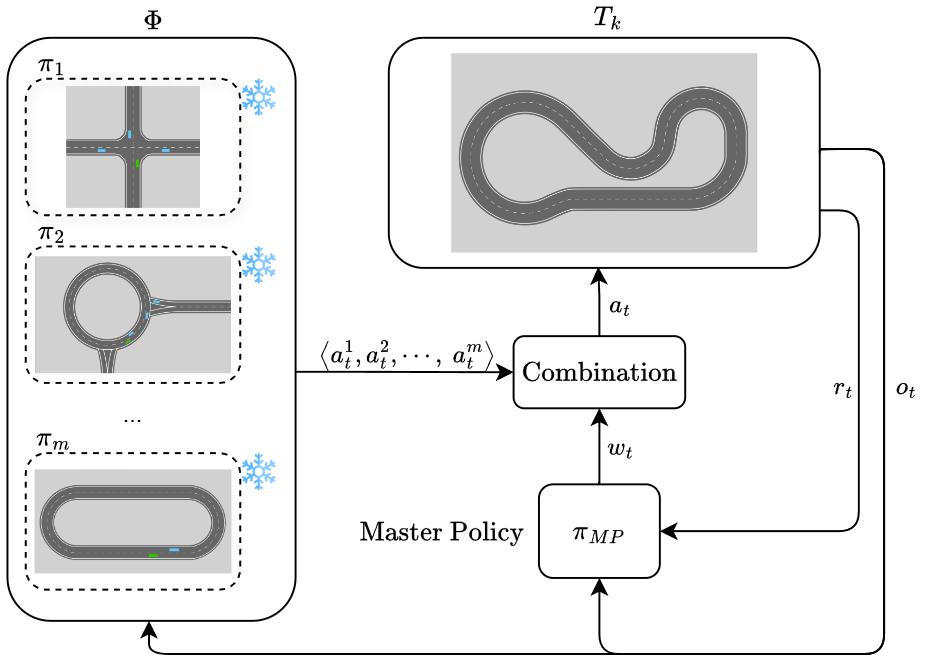
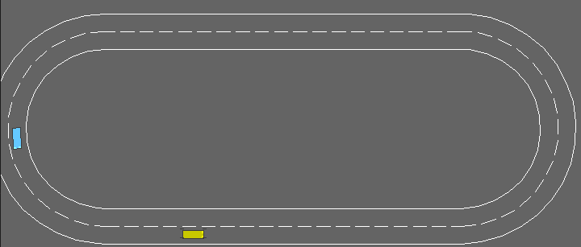

<div align="center">
  <h1 align="center">IKH-Combining-Prior-Policies-to-Solve-New-Tasks</h1>
</div>
This is the implementation of the auxiliary paper titled: "I Know How: Combining Prior Policies to Solve New Tasks" accepted by IEEE Conference on Games (CoG) 2024

# About

The repository presents a novel way of reusing past knowledge learned by RL agents on old tasks. 
RL agents are efficient to solve simple tasks, but if new tasks becomes more and more complex to be solved, training each time from scratch is not a viable or sustainable solution.

In the IKH framework, we stores a set of pre-trained policies on simple tasks as a set of basic skills the agents can reuse. For a new arrived task, we train a higher-level policy to combine the actions drawn from skills, and the final actions is used to interact with the environment.

 <p align="center">
  <br />
  <em>Illustration of the implementation of the IKH framework used in this work. Given a set of pre-trained policies on auxiliary tasks, Master Policy predicts the weights w to assign at each action from the policies to define agents' behavior.</em>
</p>

# Getting Start

## 1. Clone the repository
```shell
git clone --recursive https://github.com/xiaoli98/IKH-Combining-Prior-Policies-to-Solve-New-Tasks.git
cd IKH-Combining-Prior-Policies-to-Solve-New-Tasks
```

## 2. Install custom version of HighwayEnv and stable-baselines3
```shell
pip install -e ./HighwayEnv -e ./stable-baslines3
```

## 3. Install other requirements
```shell
pip install -r requirements.txt
```

## 4. Running experiments
You can find some examples in experiments*.sh files. 
Some pretrained skills can be found in src/checkpoint, which are ready to use for sac_master.py and sac_pnn.py
To train your own skills:
```shell
python3 src/sac.py
```

To see configurable parameters use:
```shell
python3 src/sac.py -h
```


# Changes in HighwayEnv and stable-baselines3
To adapt to our framework we modified the environment of [HighwayEnv](https://github.com/Farama-Foundation/HighwayEnv) and [stable-baselines3](https://github.com/DLR-RM/stable-baselines3)

## Highway-env
We added two additional environments: indiana-v0 and lane-centering-v0, other environments are similar to the original ones, with environment reset when the controlled vehicle is going off-track and customized reward function.
### indiana-v0
 <p align="center">
  <br />
</p>

### lane-centering-v0
 <p align="center">
  <br />
</p>

## stable-baselines3
We modified stable-baselines3's SAC algorithm to adapt it to act as the Master Policy, therefore receives actions from skills and combines them to obtain the final action.

# Citation
```
@misc{li2024iknowhowcombining,
    title={I Know How: Combining Prior Policies to Solve New Tasks}, 
    author={Malio Li and Elia Piccoli and Vincenzo Lomonaco and Davide Bacciu},
    year={2024},
    eprint={2406.09835},
    archivePrefix={arXiv},
    primaryClass={cs.LG},
    url={https://arxiv.org/abs/2406.09835}, 
}
```